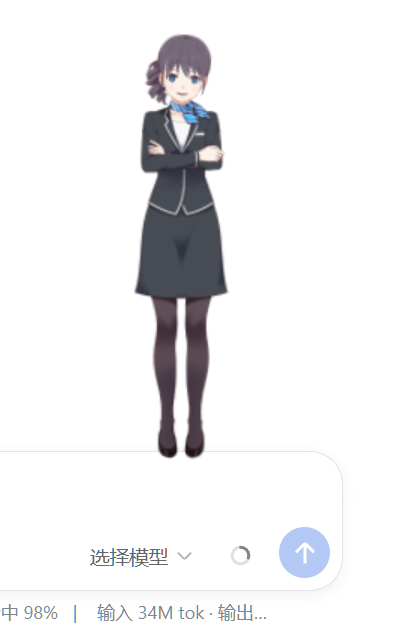

# dsh-live2d-pet

> A Live2D companion for [DeepSeek Harness](https://github.com/deepseek-ai/deepseek-harness): renders a Cubism model as a floating companion in the Web UI, with state-driven expressions and mouse tracking.
>
> DSH 桌宠的 Live2D 渲染插件：在 Web UI 里渲染一个 Cubism 模型，带表情切换和鼠标跟随。



## Features / 功能

- 🐳 **Real Live2D model** — powered by [pixi-live2d-display](https://github.com/guansss/pixi-live2d-display) (Cubism 4), rendered on a floating canvas
- 👀 **Mouse tracking** — head turns and gaze follow your cursor (ParamAngleX/Y, ParamEyeBallX/Y)
- 😊 **Expression switching** — the model's `.exp3.json` expressions map to harness activity states (idle/waiting/thinking/tool/done)
- 🎛️ **Config-driven geometry** — size/position come from `cordis.patch.yml`, tweak without rebuilding
- 💾 **localStorage toggle** — `dsh-live2d-pet` key, survives refreshes

## Install / 安装

```bash
# from a local checkout (or use a link: dependency)
dsh plugin --profile web add link:/path/to/dsh-live2d-pet
# or from npm
dsh plugin --profile web add dsh-live2d-pet
```

## Enable / 启用（必读！）

> ⚠️ **The model does NOT appear automatically after install.** You must run
> one line in the browser console first:
> ⚠️ **装完不会自动显示！** 必须先在浏览器控制台执行下面这行：

```js
localStorage.setItem('dsh-live2d-pet', '1')
```

1. Open the DSH web page (the profile where you installed the plugin)
2. Press `F12` → Console tab
3. Paste `localStorage.setItem('dsh-live2d-pet', '1')` and press Enter
4. Reload the page (`F5`)

The model then floats bottom-right (or wherever you configure). The setting
persists across refreshes and server restarts — you only do this once per
browser.

To disable:

```js
localStorage.setItem('dsh-live2d-pet', '0')
```

## Configuration / 配置

`cordis.patch.yml`:

```yaml
- insert:
    - id: live2d-pet
      name: dsh-live2d-pet
      config:
        model: haru/haru_greeter_t03.model3.json  # path under assets/live2d/
        size: 320                                  # canvas size, px
        right: 24                                  # distance from right edge, px
        bottom: 100                                # distance from bottom edge, px
```

Drop any Cubism 4 model into `assets/live2d/` and point `model` at it —
swap in your own character without touching code.

## Bundled model / 附带模型

The official **Haru** sample model ([Live2D Inc.](https://www.live2d.com/)) is
bundled under its official sample-model license for testing. Replace it with
your own model for production use.

## Architecture notes / 架构要点

- Host half injects the Cubism core script (`live2dcubismcore.min.js`) into
  the document head before the client bundle evaluates — `pixi-live2d-display`
  checks `window.Live2DCubismCore` at module time.
- Model assets are served from `/pet/live2d/*` (prefix route; the webserver
  matches prefixes with `${prefix}/`, so the path must have **no trailing
  slash**).
- The client bundle imports `pixi-live2d-display/cubism4` (not the main
  entry) to skip the Cubism 2 runtime check.
- Static imports only — the DSH client module system cannot load split
  chunks, so pixi is fully inlined (≈1.6 MB).
- Node builtins in dependencies (e.g. `@pixi/utils`'s `import { parse } from
  'url'`) are shimmed at build time by the [dsh-client-url-shim](https://github.com/ankesu/dsh-client-url-shim) plugin (inlined copy in `scripts/url-shim.js`).

All of these mines were cleared in an isolated test profile before shipping —
details in [the companion write-up](https://github.com/ankesu/dsh-live2d-pet) (TBD).

## License

MIT. The bundled Haru model remains © Live2D Inc. (official sample-model license).
