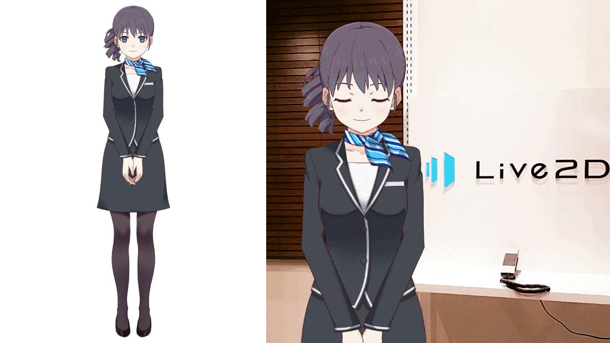
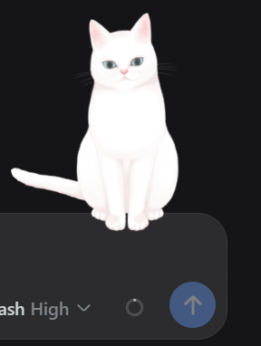
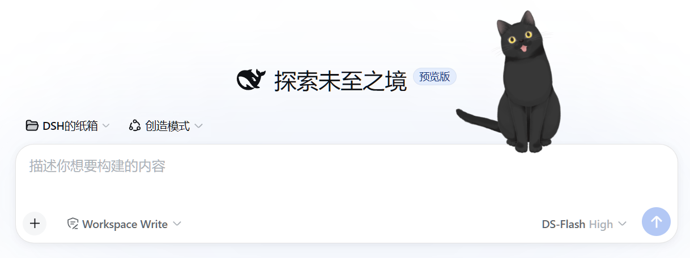
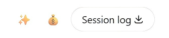

# dsh-live2d-pet

> A Live2D companion pet for [DeepSeek Harness](https://github.com/deepseek-ai/deepseek-harness) — renders a Cubism model as a floating companion in the Web UI, with state-driven expressions, mouse tracking, drag repositioning, and a header toggle button.
>
> DSH 桌宠 Live2D 插件：在 Web UI 里渲染一个 Cubism 模型作为浮动桌宠，支持状态联动表情、鼠标跟随、拖拽摆位、顶栏一键开关。

### 🐱 Haru/ 人型（默认分支）


The bundled official **Haru** sample model ([Live2D Inc.](https://www.live2d.com/)):

附带官方 Haru 示例模型（© Live2D Inc.）：



### 🐱 Tororo Cat pets / 白猫宠物（分支）

The official **Tororo & Hijiki** cat sample models
([Live2D Inc.](https://www.live2d.com/en/learn/sample/tororo-hijiki/)) run as
pets on the [`feat/tororo`](https://github.com/ankesu/dsh-live2d-pet/tree/feat/tororo)
branch — cats with ear/tail/paw parameters, parameter-snapshot expressions
(no exp3 files needed), and the sample's `Idle`/`Tap` motions:

官方 **Tororo & Hijiki** 猫示例模型（© Live2D Inc.）在
[`feat/tororo`](https://github.com/ankesu/dsh-live2d-pet/tree/feat/tororo)
分支上作为宠物运行——猫有耳朵/尾巴/爪子参数、参数快照表情（无需 exp3 文件）、
以及自带 Idle/Tap 动作：



### 🐱 Hijiki Cat pets / 黑猫宠物（分支）



> Switch to a branch for cat pets: / 切到分支即可用猫宠物：
> - White cat **Tororo**: `git checkout feat/tororo` → `pnpm build` → configure `model: tororo/tororo.model3.json`
> - Black cat **Hijiki**: `git checkout feat/hijiki` → `pnpm build` → configure `model: hijiki/hijiki.model3.json`
> (both branches use the same parameter-snapshot client; only the model path differs)

---

## Table of Contents / 目录

- [Features / 功能](#features--功能)
- [Cat pets (branch) / 猫宠物（分支）](#cat-pets--猫宠物分支)
- [Install / 安装](#install--安装)
- [Enable / 启用（必读）](#enable--启用必读)
- [Configuration / 配置](#configuration--配置)
- [State → Expression map / 状态表情映射](#state--expression-map--状态表情映射)
- [Debug handles / 调试句柄](#debug-handles--调试句柄)
- [Bring your own model / 换自己的模型](#bring-your-own-model--换自己的模型)
- [Architecture & pitfalls / 架构与排雷](#architecture--pitfalls--架构与排雷)
- [Development / 开发](#development--开发)
- [License / 许可](#license--许可)

---

## Features / 功能

| | English | 中文 |
|---|---|---|
| 🐳 **Real Live2D** | Powered by [pixi-live2d-display](https://github.com/guansss/pixi-live2d-display) (Cubism 4), rendered on a transparent floating canvas | 基于 pixi-live2d-display（Cubism 4）渲染，透明浮动画布 |
| 👀 **Mouse tracking** | Head turns and gaze follow your cursor (`ParamAngleX/Y`, `ParamEyeBallX/Y`); the iris is written every frame so expression snapshots can't clobber it | 头部与视线跟随鼠标；瞳孔每帧写入，表情快照覆盖不了 |
| 😊 **State-driven expressions** | The model's `.exp3.json` expressions map to harness activity states (`idle/waiting/thinking/tool/done/failed/sleep/…`) plus hover & drag | 表情按 AI 活动状态切换（idle/waiting/thinking/tool/done/failed/sleep…）+ hover/拖拽反馈 |
| 🎬 **Idle motion + fidgets** | The model's idle motion runs constantly; random tap motions play as idle micro-antics | 常驻待机动作；空闲时随机播小动作（发呆/挠头） |
| 🎛️ **Config-driven geometry** | Size / position / offsets come from `cordis.patch.yml` — tweak without rebuilding | 大小/位置/偏移全在 `cordis.patch.yml` 配置，改配置不用重编译 |
| 🖱️ **Drag repositioning** | Drag the pet anywhere; the offset persists in `localStorage` (with a viewport sanity-clamp against off-screen bugs) | 可拖拽到任意位置，偏移持久化（带防怼出屏幕的钳制） |
| 💾 **Toggle button & persistence** | A ✨ header button (next to the [dsh-emoji-wallet](https://github.com/ankesu/dsh-emoji-wallet) 💰 button) shows/hides the pet instantly; state survives refreshes & restarts | 顶栏 ✨ 按钮（[dsh-emoji-wallet](https://github.com/ankesu/dsh-emoji-wallet) 钱包 💰 旁边）一键开关，状态跨刷新/重启保留 |
| 🔗 **Session state linkage** | Watches the DSH conversation session — deep thinking / sleep / celebrate are time-driven | 监听 DSH 会话——深思考 / 睡觉 / 庆祝等按时间驱动 |

The ✨ toggle button lives in the session header, right next to the 💰 wallet
button from [dsh-emoji-wallet](https://github.com/ankesu/dsh-emoji-wallet)
(an optional companion plugin — the pet works fine without it; the wallet just
happens to sit in the same utilities row):

顶栏 ✨ 开关按钮（会话头部，[dsh-emoji-wallet](https://github.com/ankesu/dsh-emoji-wallet)
钱包 💰 旁边——钱包是可选伴生插件，不装它宠物也完全正常，只是同一个顶栏行里挨着）：



---

## Install / 安装

All install methods below were verified end-to-end in a clean profile (2026-08-28):
haru from the npm registry, and each cat branch from GitHub — `pnpm install`
runs a `prepare` script that builds `lib/client.js` automatically, and the
bundled `cordis.patch.yml` already points at the right model. Zero extra config.

以下安装方式均已在干净 profile 中完整实测（2026-08-28）：haru 走 npm registry，
黑白猫走 GitHub 分支——`pnpm install` 会自动执行 `prepare` 构建 `lib/client.js`，
包内 `cordis.patch.yml` 已默认指向对应模型，零额外配置。

### Option A — npm registry (Haru, default branch) / npm 源安装（Haru 人型，默认）

```bash
# install / 安装
dsh plugin --profile <name> add dsh-live2d-pet

# or, in the profile dir directly / 或直接在 profile 目录里
cd ~/.dsh/profiles/<name>
pnpm add dsh-live2d-pet
```

- Installs the latest published `dsh-live2d-pet` (haru model). Verified: `0.1.2`.
- 安装最新发布版 `dsh-live2d-pet`（haru 模型）。已验证：`0.1.2`。
- ⚠️ **If you previously installed an older version, `pnpm add` may keep the
  stale lockfile entry (e.g. `0.1.1`). Pin the version to force the update:**
  `pnpm add dsh-live2d-pet@0.1.2` (or delete `pnpm-lock.yaml` and re-install).
- ⚠️ 若之前装过旧版，`pnpm add` 可能沿用旧 lock 条目（如 `0.1.1`）。指定版本强制更新：
  `pnpm add dsh-live2d-pet@0.1.2`（或删掉 `pnpm-lock.yaml` 重装）。

### Option B — GitHub branch: white cat Tororo / Git 分支：白猫 Tororo

```bash
cd ~/.dsh/profiles/<name>
pnpm add "git+https://github.com/ankesu/dsh-live2d-pet.git#feat/tororo"
```

- White cat **Tororo** (cat client, `PARAM_*` params, parameter-snapshot expressions).
  Verified: install + build + patch → tororo model, all good.
- 白猫 **Tororo**（猫版 client，`PARAM_*` 参数 + 参数快照表情）。已验证：安装/构建/patch 全部正常。

### Option C — GitHub branch: black cat Hijiki / Git 分支：黑猫 Hijiki

```bash
cd ~/.dsh/profiles/<name>
pnpm add "git+https://github.com/ankesu/dsh-live2d-pet.git#feat/hijiki"
```

- Black cat **Hijiki** (same cat client, different model path). Verified.
- 黑猫 **Hijiki**（同一猫版 client，不同模型路径）。已验证。

### Option D — GitHub branch: main (Haru) / Git 分支：main（Haru）

```bash
cd ~/.dsh/profiles/<name>
pnpm add "git+https://github.com/ankesu/dsh-live2d-pet.git#main"
```

- Same as the npm registry build, from source. Verified.
- 与 npm registry 版相同，从源码装。已验证。

### Notes for git-branch installs / Git 分支安装注意事项

1. **Proxy** — GitHub fetches can stall without one. If installs hang, configure
   your proxy (e.g. `npm config set proxy http://127.0.0.1:7897` / `https-proxy`),
   or set `HTTP_PROXY`/`HTTPS_PROXY` env vars for the install command.
   Git 拉取 GitHub 可能卡住。卡住时配代理（如 `npm config set proxy http://127.0.0.1:7897`
   与 `https-proxy`），或在安装命令前设 `HTTP_PROXY`/`HTTPS_PROXY` 环境变量。
2. **pnpm allowBuilds** — pnpm blocks the `prepare` build script by default
   (supply-chain protection). If you see `ERR_PNPM_GIT_DEP_PREPARE_NOT_ALLOWED`,
   add the exact line it prints to `pnpm-workspace.yaml` under `allowBuilds:`.
   pnpm 默认拦截 `prepare` 构建脚本（供应链保护）。若报
   `ERR_PNPM_GIT_DEP_PREPARE_NOT_ALLOWED`，把报错打印的那一行加到
   `pnpm-workspace.yaml` 的 `allowBuilds:` 下即可。
3. **Enable the pet** — after install, the pet does not show until enabled:
   click the ✨ header button or run `localStorage.setItem('dsh-live2d-pet','1')`
   in the browser console, then reload.
   装完后宠物不会自动显示——点顶栏 ✨ 按钮或在浏览器 Console 执行
   `localStorage.setItem('dsh-live2d-pet','1')`，然后刷新页面。

Use a different profile by changing `--profile <name>` (e.g. `test`).

> 换成自己的 profile 只需改 `--profile <name>`（例如测试端 `test`）。

---

## Enable / 启用（必读）

> ⚠️ **The model does NOT appear automatically after install.** You must enable
> it first — either click the ✨ button in the session header, or run one line
> in the browser console.
> ⚠️ **装完不会自动显示！** 必须先启用——点顶栏 ✨ 按钮，或在浏览器控制台执行下面这行：

```js
localStorage.setItem('dsh-live2d-pet', '1')
```

1. Open the DSH web page (the profile where you installed the plugin)
2. Press `F12` → Console tab
3. Paste `localStorage.setItem('dsh-live2d-pet', '1')` and press Enter
4. Reload the page (`F5`)

The pet then floats at the anchor position (default: bottom-right / above the
composer). The setting persists across refreshes and server restarts — you only
do this once per browser.

启用后宠物出现在锚定位置（默认：右下/输入框上方）。设置跨刷新和重启保留，每个浏览器只需设置一次。

To disable / 关闭：

```js
localStorage.setItem('dsh-live2d-pet', '0')
```

---

## Configuration / 配置

`cordis.patch.yml` (in the plugin package):

```yaml
- insert:
    - id: live2d-pet
      name: dsh-live2d-pet
      config:
        model: haru/haru_greeter_t03.model3.json  # path under assets/live2d/
        size: 320                                  # canvas size, px
        right: 24                                  # distance from right edge, px
        bottom: 100                                # distance from bottom edge, px
        offsetX: 0                                 # extra horizontal shift, px
        offsetY: 0                                 # extra vertical shift, px
```

| Key | Meaning / 含义 | Default / 默认 |
|---|---|---|
| `model` | Path to the `.model3.json` under `assets/live2d/` | `haru/haru_greeter_t03.model3.json` |
| `size` | Canvas size in px (the model is scaled to fit by height) | `320` |
| `right` | Distance from the right edge when not anchored | `24` |
| `bottom` | Distance from the bottom edge when not anchored | `20` |
| `offsetX` / `offsetY` | Extra shift applied on top of the anchor position (for fine-tuning) | `0` |

> The pet anchors to the chat composer (`[data-composer-seat]`) every frame and
> follows internal chat scrolling; `right/bottom` are only used as fallbacks.
> `offsetX/offsetY` are the knobs for final fine-tuning.

> 宠物每帧锚定到聊天输入框（`[data-composer-seat]`）并跟随内部滚动；`right/bottom`
> 只是兜底位置。微调用 `offsetX/offsetY`。

---

## State → Expression map / 状态表情映射

The bundled **Haru** sample model ships expressions `f00..f08`. The default
mapping (edit `PHASE_EXPRESSION` in `src/client/index.ts` to customize):

附带模型 Haru 提供表情 `f00..f08`。默认映射如下（改 `src/client/index.ts` 的
`PHASE_EXPRESSION` 可自定义）：

| State / 状态 | Expression / 表情 | Meaning / 含义 |
|---|---|---|
| `idle` | `f00` | neutral / 中性 |
| `waiting` | `f01` | expectant, mouth slightly open / 等待，微张嘴 |
| `thinking` | `f02` | concentrating, brows knit / 思考，皱眉 |
| `deep` (thinking > 5s) | `f02` | same concentration face / 深思考同款 |
| `tool` (a tool is running) | `f03` | working, grin / 干活，咧嘴 |
| `done` (turn finished) | `f04` | happy squint / 完成，眯眼笑 |
| `celebrate` (done + ≥3 tools) | `f04` | happy / 庆祝同款 |
| `failed` | `f00` | sample set has no sad face → neutral / 无委屈脸，用中性 |
| `drag` (being dragged) | `f05` | big grin / 拖拽，大笑 |
| `sleep` (idle > 60s) | `f08` | calm / 平静 |
| hover (idle/sleep) | `f06` | surprise, wide eyes / 惊讶瞪眼 |

**Motions / 动作**：Haru only ships `Idle` + `Tap` groups. The idle motion runs
constantly; random `Tap` motions play as idle fidgets. There are no per-state
body animations on the sample — custom models can add a `TOOL_MOTION` map.

Haru 只带 `Idle` + `Tap` 两组动作：待机动作常驻，空闲时随机播 `Tap` 小动作。
样例模型没有按状态的专属动作——自定义模型可加 `TOOL_MOTION` 映射。

---

## Debug handles / 调试句柄

Open the browser console (F12) on the page with the pet:

| Handle / 句柄 | Purpose / 用途 |
|---|---|
| `window.__dshLive2dPetModel` | The loaded `Live2DModel` instance / 已加载的模型实例 |
| `pet('expr','motion')` | One-shot test: set expression + play motion (either may be omitted) / 一句测试：设表情+播动作（可省略） |
| `window.__dshLive2dPetToggle()` | Toggle the pet on/off programmatically / 编程式开关宠物 |
| `window.__dshLive2dPetFreeze = true` | **Freeze automatic linkage** (manual tests stick) — set `false` to resume. ⚠️ While frozen, real DSH turns will NOT update the pet. / **冻结自动联动**（手动测试不被状态覆盖），`false` 恢复。⚠️ 冻结期间真实流程不会更新宠物 |
| `window.__dshLive2dPetRoot` | The React root handle / React 根句柄 |

Example / 示例：

```js
pet('f02', 'Tap')   // thinking face + a random tap motion / 思考脸 + 随机小动作
pet('f04')          // done face only / 只切完成表情
window.__dshLive2dPetFreeze = false   // resume auto linkage / 恢复自动联动
```

---

## Bring your own model / 换自己的模型

1. Put your model folder under `assets/live2d/<model>/` (`.model3.json`, `.moc3`,
   textures, `.physics3.json`, `expressions/`, `motions/`).
2. Point `cordis.patch.yml` `config.model` at it.
3. Update `PHASE_EXPRESSION` (and optionally `TOOL_MOTION`) in
   `src/client/index.ts` to your model's expression/motion group names, then
   `pnpm build`.
4. Sync `lib/` + `assets/` to the target profile's `node_modules/dsh-live2d-pet/`,
   restart the server (patch/model changes), hard-refresh the page
   (Ctrl+Shift+R) — model/expression changes need the hard refresh to load.

> 把模型放进 `assets/live2d/<模型名>/`，配置 `model` 指向它，改好表情/动作映射，
> `pnpm build` 后同步到目标 profile，重启服务端（patch/模型改动），硬刷新页面
> （Ctrl+Shift+R，模型/表情改动必须硬刷新才加载）。

The architecture is model-agnostic — the pet is the harness, the model is the
skin. / 架构与模型无关——宠物是壳，模型是皮。

---

## Architecture & pitfalls / 架构与排雷

### How it works / 工作原理

```
DSH web page
├─ <head> script src="/pet/live2d/live2dcubismcore.min.js"   ← host half, injected via tapIndex
├─ client bundle (lib/client.js, single inlined file)
│   ├─ pixi.js + pixi-live2d-display/cubism4 (fully inlined)
│   ├─ Live2DPet component: anchor / drag / expression / motion / mouse tracking
│   └─ apply(): mount + session-state linkage + ✨ toggle button (slots)
└─ host routes /pet/live2d/* (prefix, serves model assets)
```

### Design constraints (all battle-tested) / 关键约束（全部实战排雷）

1. **No dynamic imports** — the DSH client module system can't load split
   chunks (`missed the module table`). Everything is statically inlined into a
   single file. / 禁止动态 import——DSH 客户端模块系统不认分包，必须全内联单文件。
2. **Cubism core must load first** — `pixi-live2d-display` checks
   `window.Live2DCubismCore` at module time; the host injects the core script
   into `<head>` before the bundle evaluates. / Cubism core 必须先行——host 在
   bundle 执行前注入到 head。
3. **Use the `cubism4` sub-entry** — the main entry checks both Cubism 2 and
   Cubism 4 runtimes; `import 'pixi-live2d-display/cubism4'` skips the Cubism 2
   check. / 只用 cubism4 子入口——绕过 Cubism 2 运行时检查。
4. **Prefix route without trailing slash** — the webserver matches prefixes
   with `${prefix}/`, a trailing slash becomes `//` and never matches. /
   前缀路由不带尾斜杠——带尾斜杠会拼成双斜杠匹配不上。
5. **React must be external** — an inlined second React instance breaks hooks
   in slots-rendered components (React error #321). `react`/`react-dom` come
   from the DSH host module table (same as `dsh-emoji-wallet`). / React 必须
   external——内联第二份 React 会让 slots 组件 hook 崩溃，从 DSH 模块表拿。
6. **`ctx.slots` needs the inject declaration** — both the package.json
   `dsh.client.inject` entry (`@deepseek-ai/dsh-client-ui-slots`) AND
   `export const inject = ['slots']` in the bundle are required, or you get
   "cannot get property slots without inject". / slots 按钮要双重 inject——
   package.json 包名 + bundle 里 `export const inject = ['slots']`。
7. **Physics output params are locked** — on some models, physics-driven
   parameters (e.g. tail `Param_Angle_Rotation_*`) are overwritten every frame;
   motions can't move them. / 物理输出参数被锁——物理每帧覆盖，动作曲线写不动。
8. **Drag offset sanity clamp** — a leftover absurd `dsh-live2d-pet-drag`
   localStorage value can push the pet off-screen; the loader clamps to the
   viewport and drops bad values. / 拖拽偏移钳制——异常残留偏移会被自动清除，
   防止宠物被怼出屏幕。
9. **Toggle must reset the session identity** — `tearDownSession()` resets
   `currentSessionId`/`lastKey`, otherwise toggling the pet off/on kills the
   state-linkage refresh loop forever (pet renders but never reacts). /
   toggle 必须重置会话身份——否则开关一次后状态联动永久死亡（宠物能显示但不再反应）。

### Node builtins in dependencies

`@pixi/utils` imports node's `url`; `scripts/url-shim.js` (a copy of the
[dsh-client-url-shim](https://github.com/ankesu/dsh-client-url-shim) plugin)
rewrites it to a browser-safe module at build time.

---

## Development / 开发

```bash
pnpm install
pnpm build        # tsdown → lib/client.js (browser) + lib/index.mjs (node)
pnpm typecheck    # tsc --noEmit
```

### Generator scripts / 生成器脚本

The plugin ships model-agnostic tooling under `scripts/`:

| Script / 脚本 | Purpose / 用途 |
|---|---|
| `scripts/gen-motions.mjs <assetsDir> [--force]` | Generate `motion3.json` actions + `exp3.json` expressions from code definitions. **Existing `*.exp3.json` are SKIPPED by default** (hand-tuned expressions win); `--force` overwrites them (use with care). / 从代码定义生成动作/表情；**默认跳过已存在的 exp3**（手动调参优先），`--force` 才覆盖 |
| `scripts/sync-expressions.mjs <assetsDir>` | Refresh the generator's expression defaults from the live exp3 files (keeps the generator in sync with hand-tuned assets). / 从资产现成 exp3 刷新生成器的表情默认值 |
| `scripts/expressions-data.mjs` | Generated data file (do not edit by hand). / 生成的数据文件，勿手改 |

### Workflow for editing expressions / motions / 改表情/动作流程

1. Hand-tune in **Live2D Cubism Viewer** (open the `.model3.json`, drag
   parameters / keyframes, export the exp3/motion3) — or edit the generator
   definitions.
2. `node scripts/sync-expressions.mjs <assetsDir>` to refresh expression
   defaults (hand-tuning wins; the generator never overwrites existing exp3).
3. `pnpm build` → sync `lib/` + `assets/` to the target profile.
4. Hard-refresh the page (Ctrl+Shift+R) — model/expression changes need it.

> 人工调参用 **Live2D Cubism Viewer** 打开 `.model3.json` 拖参数/摆关键帧，导出
> exp3/motion3 即生效。表情手动调参后跑同步脚本刷新生成器默认值——生成器永不覆盖
> 已有表情文件。

---

## License / 许可

MIT. The bundled **Haru** model is © Live2D Inc., distributed under its
official sample-model license for testing — replace it for production use.

MIT 许可。附带的 Haru 模型 © Live2D Inc.，按官方样例模型许可随附用于测试——
生产环境请替换为自己的模型。
